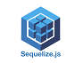

# Веб-сервер для БД веб-пользователей

Web-сервер работает с базой данных профилей пользователей. Реализована поддержка текстовых блоков - сущностей, содержащих заголовок, изображение и текст.

Поддерживается работа с файлами, изображения загружаются в базу данных и на сервер.

В БД используются следующие сущности (таблицы): 

roles (Роли), users (Пользователи), user_roles (таблица-связка для отношения многие-ко-многим между roles и users), profiles (Профили), blocks (Блоки), files (Файлы).

Документация доступна по адресу  "хост":"порт"/api/docs#/, где "хост":"порт" соответственно хост и порт, на которых работает сервер.

## Порядок использования сервера

Сервер разрабатывался в среде VS Code, использовались технологии/БД/фреймворк NodeJS, NestJS, TypeScript, Sequelize, Swagger, Postgres SQL. Сервер тестировался на локальном хосте с помощью Postman. 

Перед запуском сервера создайте в pgAdmin базу данных web_users. 

Для запуска и тестирования установите необходимые зависимости и выполните: 

npm run start:dev